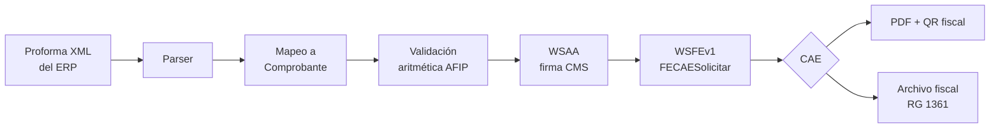
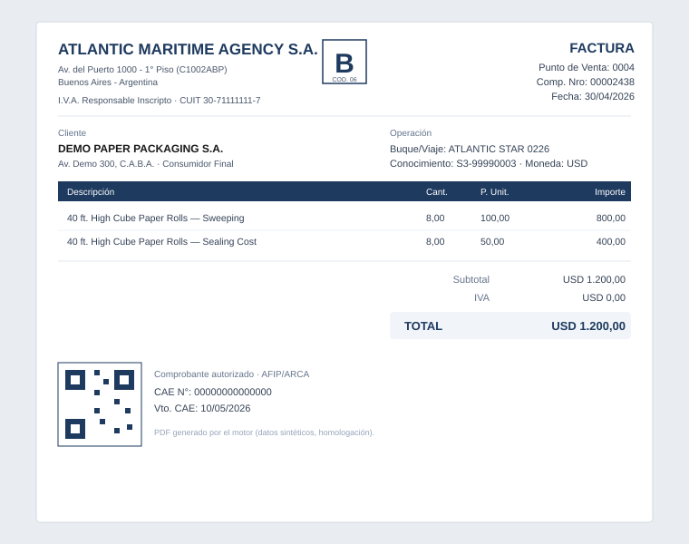

# 🧾 Facturación Electrónica ARCA/AFIP — Agencia Marítima

> Aplicación de escritorio (.NET 8 / WPF) que emite comprobantes electrónicos
> contra los webservices de **ARCA/AFIP** (organismo tributario argentino),
> implementando las reglas particulares de facturación de una **agencia marítima**:
> toma proformas del ERP, las mapea a comprobantes fiscales, las firma, las envía
> a AFIP, obtiene el CAE y genera el PDF con QR.


[](https://github.com/toomastorres/arca-electronic-invoicing/actions/workflows/ci.yml)

> ℹ️ **Sobre los datos:** el código y las reglas de negocio son reales, pero esta
> es una versión **anonimizada para portafolio**. Se eliminaron certificados,
> claves, contraseñas y todo dato fiscal real; los fixtures de prueba y los
> ejemplos usan datos **sintéticos** y el **entorno de homologación (testing)**
> de AFIP, nunca producción. **Los montos son ilustrativos** — no son los valores
> originales; sólo sirven para demostrar el funcionamiento del programa.

---

## El dominio

Facturar en Argentina contra AFIP no es "generar un PDF": hay que autenticarse con
un certificado digital (WSAA), armar la solicitud SOAP exacta (WSFEv1), respetar
validaciones aritméticas y de negocio del organismo, obtener el **CAE**
(Código de Autorización Electrónico) y archivar el comprobante. Encima de eso, una
agencia marítima agrega reglas propias:

| Regla particular | Qué resuelve |
|---|---|
| **Pesificación "en vuelo"** | AFIP rechaza facturas en moneda extranjera si la cotización difiere de la oficial. La agencia maneja su propia cotización, así que el comprobante se clona y pesifica antes de enviarlo a ARCA. |
| **Mapeo de condición IVA del ERP** | Convierte los códigos de IVA del ERP de origen ("Nápoles") a los códigos que espera AFIP. |
| **Percepciones IIBB CABA (CM05)** | Cálculo de percepciones de Ingresos Brutos por jurisdicción (Convenio Multilateral), leyendo el padrón AGIP. |
| **Archivo fiscal RG 1361** | Persistencia inmutable de los comprobantes y respuestas de ARCA (requisito legal de 10 años). |
| **FCE MiPyME** | Soporte de Factura de Crédito Electrónica (CBU/alias, opcionales 2101/2102). |

## Arquitectura (Clean Architecture + MVVM)

```
src/
├── FacturacionArca.Domain/          # Entidades y enums, sin dependencias externas
│   └── Comprobantes, Proformas, Padrones, Wsaa, Errores (catálogo de 29 códigos ARCA)
├── FacturacionArca.Application/      # Casos de uso + interfaces (puertos)
│   ├── UseCases/   EmitirComprobante, MapearProformaAComprobante, CalcularPercepcionIibbCaba, ...
│   └── Validacion/ ValidadorAritmeticoAfip, ValidadorReglasNegocio
├── FacturacionArca.Infrastructure/  # Adaptadores: SOAP, EF Core, parsing, PDF
│   ├── Arca/   Wsaa (firma CMS/PKCS#7), Wsfev1, Wsfecred
│   ├── Persistence/  EF Core + SQLite (repositorios)
│   ├── XmlNapoles/   parser tolerante de proformas del ERP
│   ├── Pdf/    MigraDoc/PDFsharp + QR fiscal (QRCoder)
│   └── Padrones/  parser del padrón AGIP (IIBB)
├── FacturacionArca.Wpf/             # UI WPF (MVVM con CommunityToolkit.Mvvm) + bootstrap DI
└── FacturacionArca.Tests/           # xUnit + FluentAssertions + Moq (30 pruebas)
```

El dominio no conoce a AFIP ni a EF Core: la `Application` define interfaces
(`IArcaWsaaClient`, `IArcaWsfev1Client`, `IComprobanteRepository`, …) que la
`Infrastructure` implementa. Esto permite testear el mapeo, las validaciones y la
construcción del SOAP sin tocar la red.

### Flujo de emisión



## Stack

.NET 8 · WPF + CommunityToolkit.Mvvm · EF Core 8 + SQLite · System.ServiceModel (SOAP) ·
System.Security.Cryptography.Pkcs (firma CMS) · PDFsharp/MigraDoc + QRCoder · Serilog ·
xUnit + FluentAssertions + Moq.

## Cómo correr las pruebas

```bash
dotnet test src/FacturacionArca.Tests/FacturacionArca.Tests.csproj
# 30 pruebas: parsing de proformas, mapeo a comprobante, validación aritmética,
# firma CMS, construcción del SOAP FECAESolicitar, FCE, generación de PDF.
```

La CI ([.github/workflows/ci.yml](.github/workflows/ci.yml)) corre estas pruebas en
cada push sobre `windows-latest`.

### Ejecutar la app (WPF, requiere Windows)

```bash
dotnet run --project src/FacturacionArca.Wpf
```

Configuración por variables de entorno (todas opcionales; modo **homologación** por
defecto). **Nunca** comitear valores reales:

```powershell
[Environment]::SetEnvironmentVariable("FA_CUIT", "20111111112", "User")
[Environment]::SetEnvironmentVariable("FA_CERT_PATH", "C:\ruta\certificado.pfx", "User")
[Environment]::SetEnvironmentVariable("FA_CERT_PASS", "<password>", "User")
```

## Demo



📄 **PDF de muestra generado por la app:** [docs/sample-invoice.pdf](docs/sample-invoice.pdf)
— una factura B con QR fiscal, producida por el motor de PDF con datos sintéticos
(la genera el test `PdfGenerationDemo`, y la CI la publica como artefacto descargable).

Como es una app de escritorio, la "demo en vivo" son ese **PDF**, la **CI en verde** con
las 30 pruebas, y (recomendado) un **GIF** del flujo proforma → emisión → PDF. Ver también
[MANUAL_TECNICO.md](MANUAL_TECNICO.md) y [MANUAL_USUARIO.md](MANUAL_USUARIO.md).

## Seguridad

Los certificados digitales, claves privadas y datos fiscales **no forman parte del
repositorio** y están excluidos por [.gitignore](.gitignore). La app usa el entorno de
homologación de AFIP por defecto.

## ♻️ ¿A quién le sirve / cómo reutilizarlo?

Útil si necesitás **integrar facturación electrónica de AFIP/ARCA** (WSAA/WSFEv1) desde .NET, o como
referencia de **Clean Architecture + firma CMS + QR fiscal**. Para adaptarlo: cargá tu certificado y CUIT
por variables de entorno (`FA_*`), ajustá las reglas en la capa `Application`, y empezá en **homologación**.
Las capas `Domain`/`Application` son agnósticas de AFIP, así que podés testear el armado del SOAP sin red.
